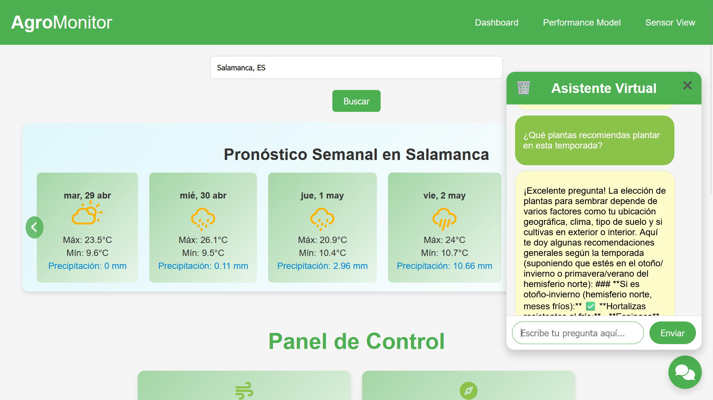

# Agro-Monitor

Agro-Monitor is a web application designed to assist farmers by providing accurate weather forecasts and crop yield predictions. By leveraging advanced machine learning models, Agro-Monitor helps optimize agricultural practices and improve productivity.

## Features

- **Weather Forecasts**: Get real-time and accurate weather updates tailored for agricultural needs.
- **Crop Yield Predictions**: Predict crop yields based on weather data, soil conditions, and other relevant factors.
- **User-Friendly Interface**: Intuitive and easy-to-navigate interface built with Vue.js.

## Technologies Used

- **Frontend**: Vue.js
- **Backend**: FastAPI
- **Machine Learning**: XGBoost for crop yield prediction models

## Installation

1. Clone the repository:
   ```bash
   git clone https://github.com/Angelo-Eyama/Agro-monitor.git
   ```
2. Navigate to the project directory:
   ```bash
   cd Agro-Monitor
   ```
3. Install the required dependencies for the backend:
   ```bash
    cd backend
    python -m venv venv
    source venv/bin/activate  # On Windows use `venv\Scripts\activate
    pip install -r requirements.txt
   ```
4. Install the required dependencies for the frontend:
   ```bash
   cd frontend
   npm install
   ```

## Usage

1. Start the backend server:
   ```bash
   uvicorn main:app --reload
   ```
2. Start the frontend development server:
   ```bash
   npm run dev
   ```
3. Open your browser and navigate to `http://localhost:5173` to access the application.
